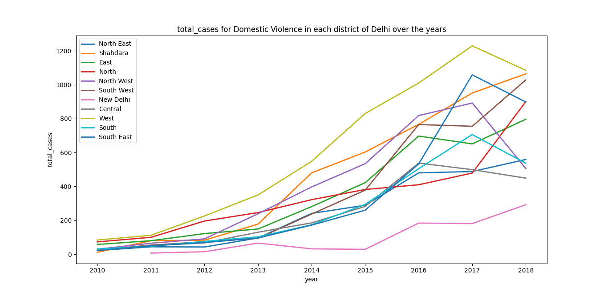

# A General Report of Delhi

## Motivation behind this report
The purpose of this report is to provide insights that can be used by local 
police and judiciary to study case trends and allocate resources in a specific 
district. These findings can be used to identify areas that are improving or 
worsening and to make appropriate adjustments. It is worth noting that this 
analysis was done for Delhi but the methodology can be applied to any 
state by providing the corresponding state code.

## Probability Density Function for Disposition Days
Once more, I did the analysis of court cases by treating them as random 
variables, this time only considering cases from the state of Delhi in the year 
2018 . I repeated this process to examine whether at the state level, the probability 
density function adheres to the gamma distribution, and indeed it does. It appears 
that the judicial system in general follows a gamma distribution.

## Case Pendency Rate for each district in Delhi over the years
This analysis is highly dependent on the selection of cases for a given year. A 
decision must be made whether to include only cases that were filed in that year 
or to also consider cases that were solved or pending in that year but were filed 
in previous years. 

The latter option provides a more realistic representation of the data, but the 
analysis for the earlier years (i.e. 2010-2014) may not be as accurate because data 
for cases filed prior to 2010 and solved after 2010 is not 
available. Therefore, I decided to plot both options, one including all open and 
solved cases in a particular year and the other only including cases that were filed in that year.

### Considering all cases in an year

It is interesting to note the drop in case pendency rate of a lot of
districts in 2014. I tried investigating this sudden drop in the case pendency
rate but I think just the metadata of the cases is not enough to tell us
why this sudden drop might have happened. One of the reasons could be that
the data is incomplete for the year 2014.

### Only considering cases filed in an year

## Mean Disposition Days for each district in Delhi over the years

### Considering all cases in an year

### Only considering cases filed in an year

## Total Domestic Violence cases for each district in Delhi over the years

## Conclusion
The data shows an increase in the number of domestic violence cases filed 
in all districts, which can be interpreted in two ways: it could indicate 
that Delhi is becoming less safe for women, or it could mean that there is 
more awareness about the issue, leading to more cases of women's domestic 
violence being reported to the court.
