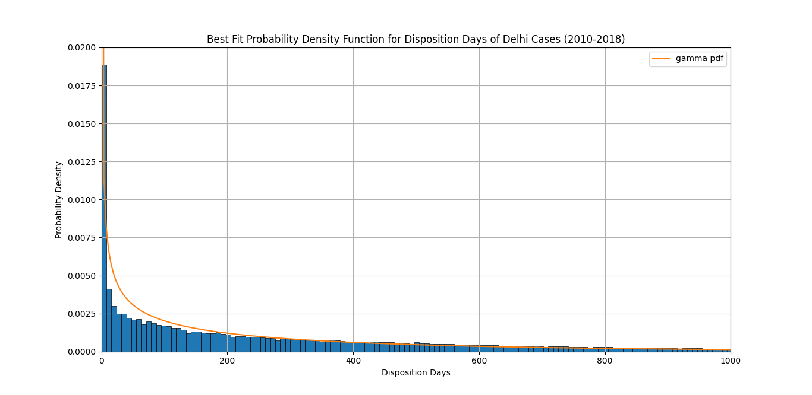
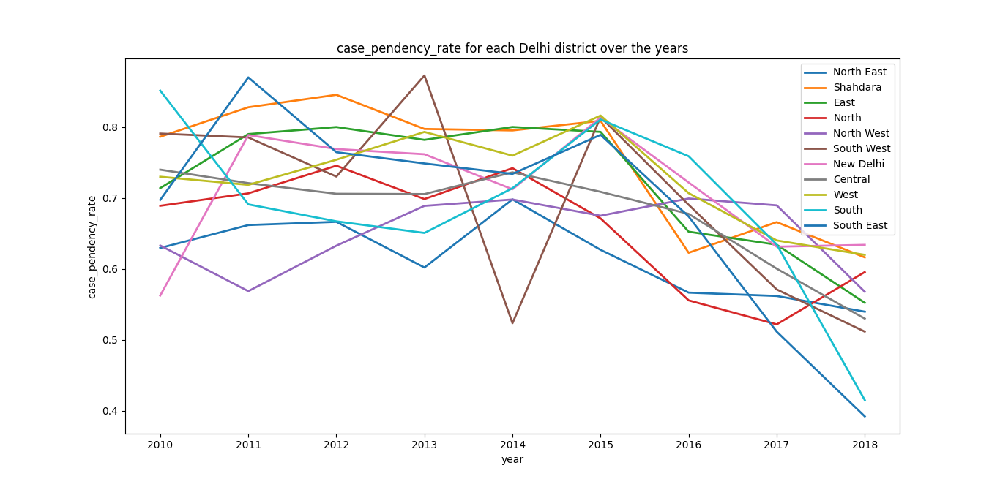
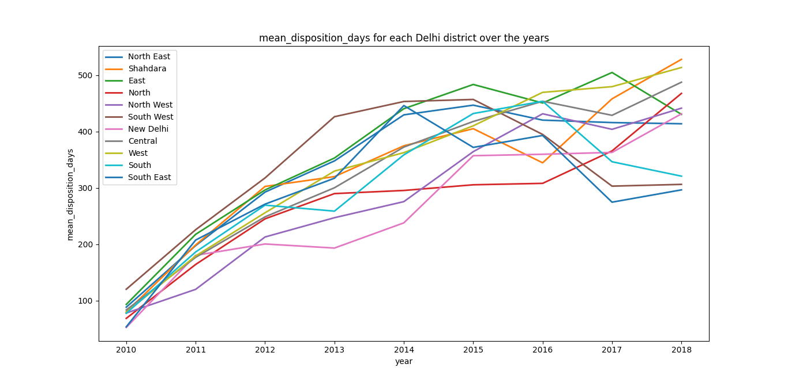

# A General Report of Delhi

## Motivation behind this report
The whole point behind this report was that these are things which can be
used by the local police to study the trends of cases in a particular
district. This report can also be used by the local judiciary to see where
things are getting better/worse and allocate resources accordingly. It should 
be noted that this is only done for Delhi but the program is general enough 
to do it for any state by just giving the appropriate state code.

## Probability Density Function for Disposition Days
Here, I have modeled the cases as a `random variable` where the value of the
random variable is the number of days between the `date of decision` and the
`date of filing`. I am thinking of each particular case as a realization of
my random variable.
I looked at all the solved cases in Delhi from 2010-2018 and plotted 
a histogram of the difference between the `date of decision` and the `date of
filing`. After that, I found the best fit probability density function for
that histogram. Using the best fit pdf, we can answer questions such as
what is the approximate probability that a case will be solved between date
`A` and date `B`.

## Case Pendency Rate for each district in Delhi over the years
> Case Pendency Rate : The ratio of the number of pending cases and the total cases

Now the question becomes, what all cases should be considered as pending/solved
for a district in a particular year, the problem arises due to the fact
that some cases were filed in previous years but were solved later, so
finally the definition that I chose was that I will consider all the cases
which were either filed in that year, solved in that year (filing date
could be from a previous year as well), or were pending in that year (again
filing date can be from a previous year)

It is interesting to note the drop in case pendency rate of South West
Delhi in 2014. I tried investigating this sudden drop in the case pendency
rate but I think just the metadata of the cases is not enough to tell us
why this sudden drop might have happened. One of the reasons could be that
the data is incomplete for the year 2014.

## Mean Disposition Days for each district in Delhi over the years
> Mean Disposition Days : The average number of days it took of dispose of a case. In other words, this is the mean difference between date of decision and date of filing.

Here, again for a district in a particular year, I have only considered cases which were 
solved in that year regardless of when the case was filed. Because of this reason we 
can see that the mean disposition days is very low in the beginning because we don't 
have data for cases that were filed before 2010 but as we go further, we get more 
accurate values of mean disposition days for those years

### Considering all cases in an year

### Only considering cases filed in an year

## Total Domestic Violence cases for each district in Delhi over the years

