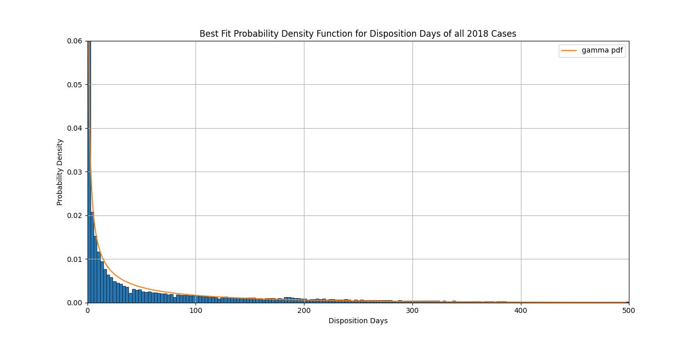
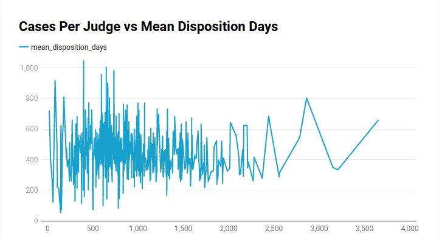
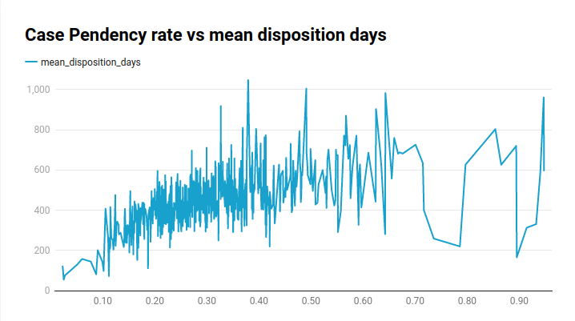
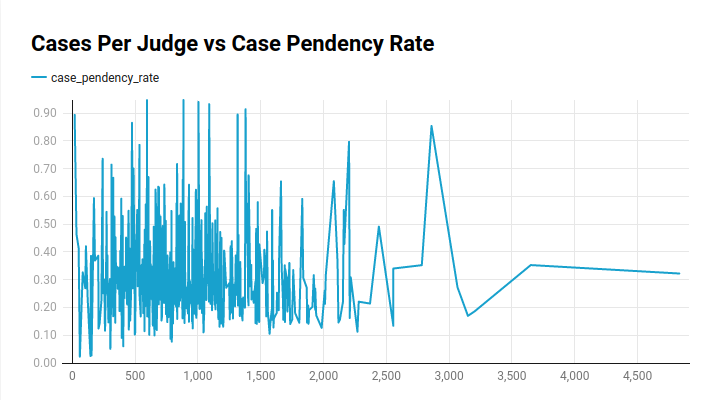

# General Analysis

## Link to all visualizations

### Correlations
- [Case Pendency Rate vs Mean Disposition Days](https://www.datawrapper.de/_/DZg2B/)
- [Cases Per Judge vs Case Pendency Rate](https://www.datawrapper.de/_/SWbek/)
- [Cases Per Judge vs Mean Disposition Days](https://www.datawrapper.de/_/PMJTD/)

### District Data-Maps
- [Mean Disposition Days Per District (2010-2018)](https://public.flourish.studio/visualisation/12403529/)
- [Case Pendency Rate Per District (2010-2018)](https://public.flourish.studio/visualisation/12409595/)
- [Number of Cases Per District Per State (2010-2018)](https://public.flourish.studio/visualisation/12501434/)

## Probability Distribution Function for all Cases of 2018
I approached the analysis of court cases by modeling them as random variables, 
where the value of the variable is the number of days between the `date of decision`
and the `date of filing`. Each case is considered as a realization of this random 
variable. I examined all the solved cases of 2018 in India and created a histogram 
of the difference between the date of decision and the date of filing After that, 
I identified the best-fit probability density function for that histogram.

I found the resulting graph to be intriguing as it reflects all the elements of the 
judicial system and follows the gamma distribution. This probability density function 
is the closest representation of the entire judicial system.

As for a use-case of this, apart from just trying to describe the whole
judicial system using a single mathematical equation. This probability
density function can be used to approximate the probability that a case in
India will solved between date `A` and date `B`.

## Correlation between various things

### Cases Per Judge vs Mean Disposition Days
As we can see, there seems to be no correlation between the average number
of cases assigned to a judge and the average amount of time it took for the
cases to be disposed off.

### Case Pendency Rate vs Mean Disposition Days 
It is observed that as the ratio of pending cases increases, the mean 
disposition days also increases. As we move above the range of 0.6-0.7, 
the density decreases due to the lack of sufficient data in that range.

### Cases Per Judge vs Case Pendency Rate
Again we can see that there is no correlation between the average number of
cases assigned to a judge and the average number of cases that are pending.

## Conclusion
From the above analysis, we can conclude that just by increasing the number
of judges (thereby decreasing the average number of cases per judge) has no
correlation/affect on the efficiency (i.e - case pendency rate and mean
disposition days) of the judiciary.
