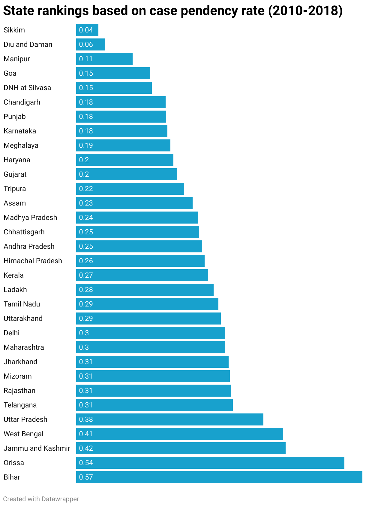
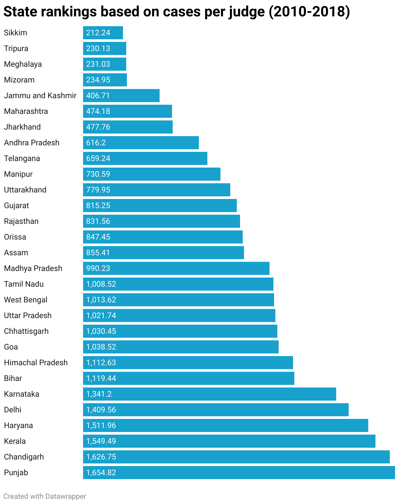
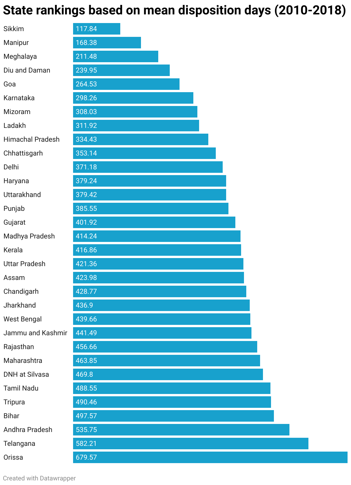

# Ranking Judicial System of Different States

## State Ranking based on Case Pendency Rate
- [Case Pendency Rate](https://www.datawrapper.de/_/rKHij/)  

## State Rankings based on Cases Per Judge
- [Cases Per Judge](https://www.datawrapper.de/_/58Aq4/)  

## State Rankings based on Mean Disposition Days
- [Mean Disposition Days](https://www.datawrapper.de/_/BLwtO/)  

