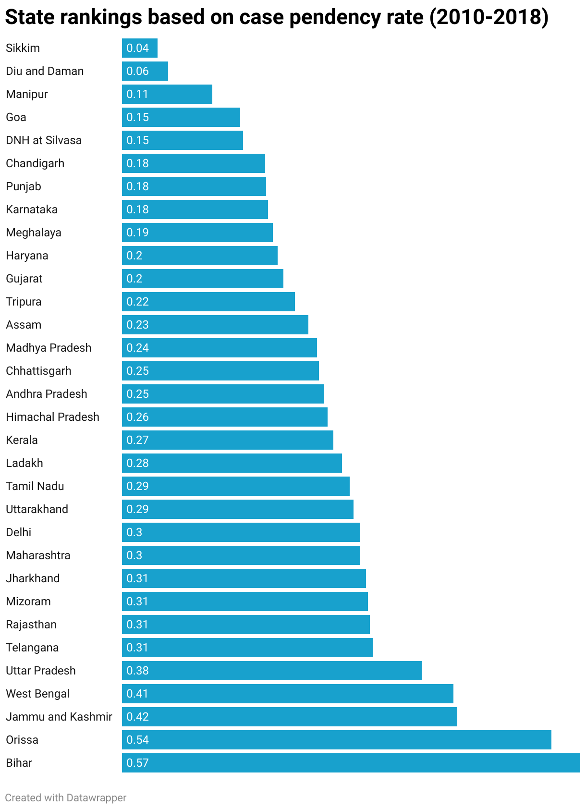
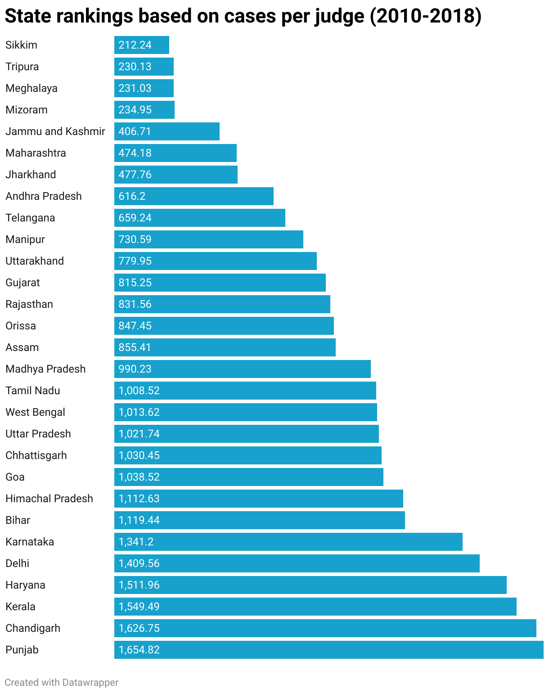
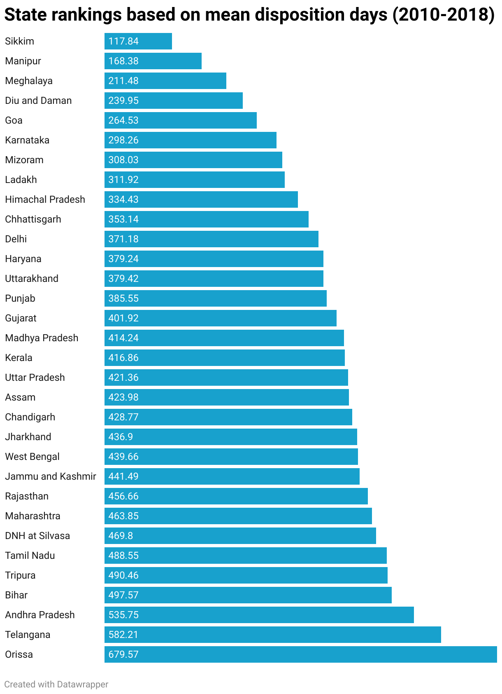

# Ranking Judicial System of Different States

## Link to visualizations
- [Ranking on Case Pendency Rate](https://www.datawrapper.de/_/rKHij/)
- [Ranking on Cases Per Judge](https://www.datawrapper.de/_/58Aq4/)
- [Ranking on Mean Disposition Days](https://www.datawrapper.de/_/BLwtO/)
- [Number of Domestic Violence Cases filed per 1000000 women - interactive map](https://public.flourish.studio/visualisation/12436114/)
- [Mean Disposition Days for Domestic Violence Cases - interactive map](https://public.flourish.studio/visualisation/12434916/)
- [Case Pendency Rate for Domestic Violence Cases - interactive map](https://public.flourish.studio/visualisation/12435177/)
- [Total Number of Domestic Violence Cases - interactive map](https://public.flourish.studio/visualisation/12437041/)

## State Ranking based on Case Pendency Rate

## State Rankings based on Cases Per Judge

## State Rankings based on Mean Disposition Days

